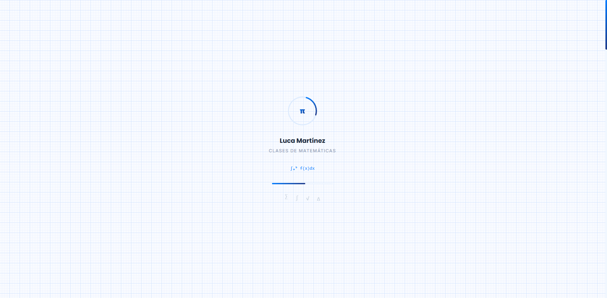
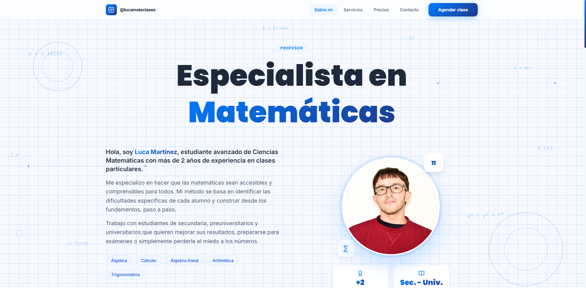
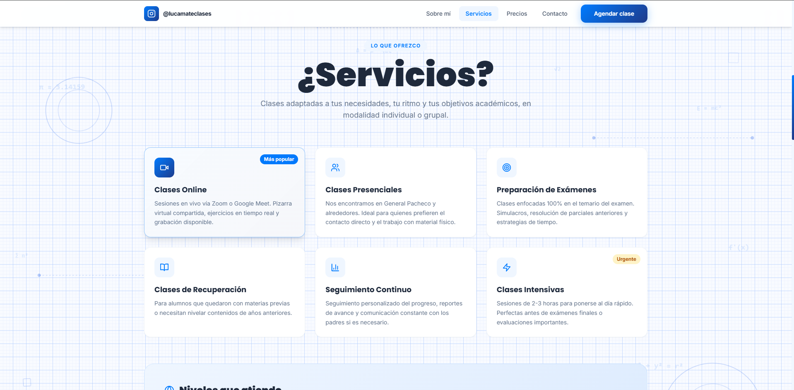
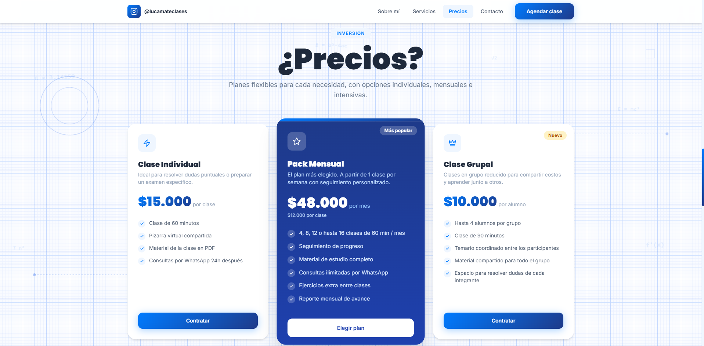
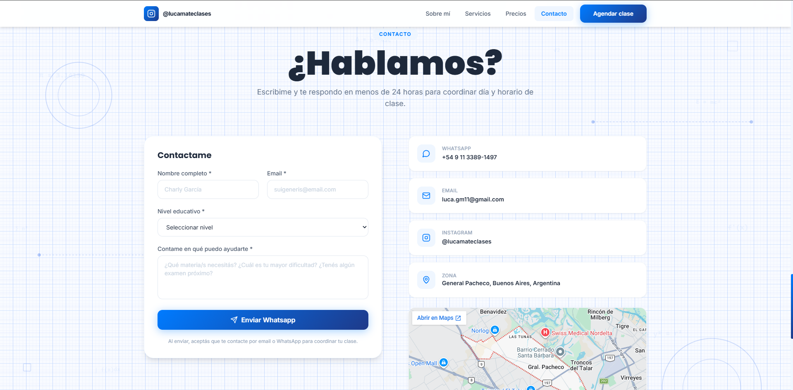

  

  # Luca Martínez Math

  **Landing page profesional para clases particulares de matemáticas**  
  *Secundaria • Preuniversitario • Universitario*

   

  
  
  
  
  

---

## 📌 Descripción

**Luca Martínez Math** es una plataforma web tipo Single Page Application (SPA) moderna, fluida y de alto impacto visual, diseñada específicamente para presentar la propuesta pedagógica del profesor Luca Martínez y convertir visitantes en consultas directas a través de WhatsApp.

> 🚀 **Sitio web en producción:** [mateconluca.netlify.app](https://mateconluca.netlify.app/)

---

## 🖼️ Galería de Capturas

  
  

 

  
  

 

  

---

## ✨ Características Principales

- ⚡ **Experiencia SPA Fluida:** Navegación dinámica con seguimiento de sección activa (`IntersectionObserver`).
- 🧮 **Identidad Visual Matemática:** Animaciones personalizadas con símbolos matemáticos ($\pi, \sum, \int$), ecuaciones flotantes y loader con barra de progreso.
- 📱 **Diseño Responsive & Mobile-First:** Adaptabilidad total a cualquier pantalla con menú hamburguesa interactivo.
- 💬 **Integración Directa con WhatsApp:** Formulario inteligente de contacto que pre-arma y envía la consulta directamente al chat.
- 🗺️ **Geolocalización:** Mapa embebido de la zona de atención en General Pacheco, Buenos Aires.
- 🔍 **Optimización SEO:** Implementación completa de Open Graph, Twitter Cards y etiquetas meta estructuradas.
- ♿ **Accesibilidad & Semántica:** Estructura semántica HTML5 con soporte para lectores de pantalla.

---

## 🛠️ Tecnologías Utilizadas

| Tecnología | Descripción |
| :--- | :--- |
| **React 18** | Biblioteca principal para el desarrollo de la interfaz de usuario modular. |
| **TypeScript** | Sistema de tipado estático para garantizar mayor solidez y mantenibilidad. |
| **Tailwind CSS** | Framework de estilos utility-first para diseño responsivo y moderno. |
| **Vite 5** | Entorno de desarrollo ultrarrápido y empaquetado optimizado. |
| **Lucide Icons** | Set de iconografía vectorial limpia y coherente. |
| **Netlify** | Infraestructura de despliegue continuo y alojamiento web. |

---

## 🤝 Créditos & Autoría

- 👨‍🏫 **Docente & Cliente:** [Luca Martínez](https://www.instagram.com/lucamateclases/) — Clases de Matemáticas.
- 💻 **Diseño y Desarrollo:** [WaveFrame Studio](https://waveframe.com.ar/)

---

## 📄 Licencia

Proyecto privado. Todos los derechos reservados © **Luca Martínez & WaveFrame Studio**.  
*Queda prohibida su reproducción o redistribución sin autorización previa del titular.*

